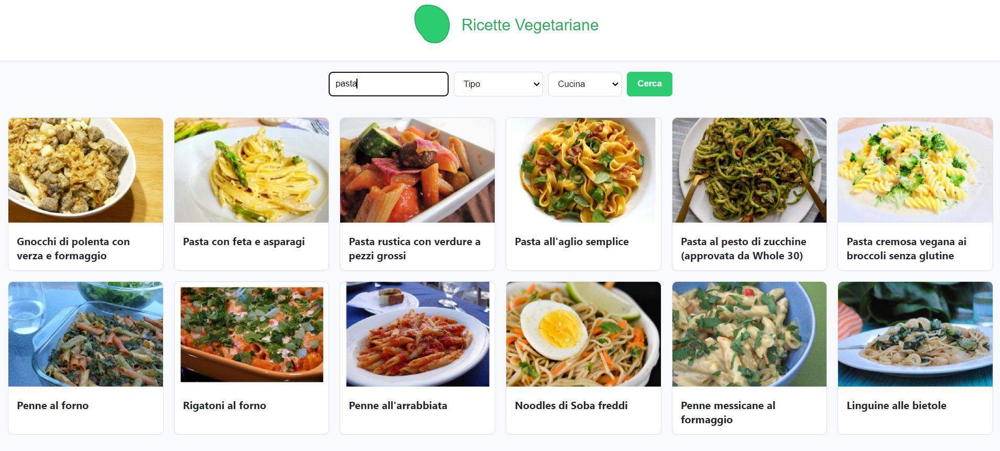
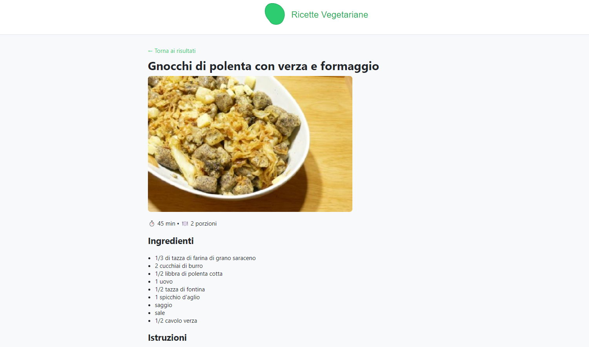

# 🥗 Vegetarian Recipes

Un sito web sviluppato con **React + Vite** che permette di cercare ricette **vegetariane** utilizzando l'API di [Spoonacular](https://spoonacular.com/food-api/docs).

🔗 **Demo online**: [https://vegetarian-recipes-app.web.app](https://vegetarian-recipes-app.web.app)  
📦 **Repository GitHub**: [https://github.com/CristianoDAlterio/vegetarian-recipes](https://github.com/CristianoDAlterio/vegetarian-recipes)

---

## 🚀 Funzionalità principali

- 🔍 Ricerca di ricette vegetariane tramite barra di ricerca
- 🖼️ Visualizzazione di titolo e immagine in una griglia responsive
- 📄 Pagina dettaglio ricetta con:
  - Ingredienti
  - Istruzioni passo-passo
  - Valori nutrizionali (prime 6 voci)
- 🎨 UI semplice e intuitiva
- 📂 Architettura modulare (componenti riutilizzabili)
- ⚡ Deploy su Firebase Hosting

---

## 📂 Struttura del progetto

```
src/
 ├─ api/            # configurazione Axios per Spoonacular
 ├─ assets/         # logo, immagini statiche
 │   ├─ home.png    # screenshot Home
 │   └─ home2.png   # screenshot RecipeDetail
 │   └─ logo.svg    # logo
 ├─ components/     # componenti riutilizzabili (SearchBar, RecipeCard, Loader, ecc.)
 ├─ context/ (RecipesContext, RecipesProvider,useRecipes)        # Context API per lo stato globale
 ├─ pages/          # pagine principali (Home, RecipeDetail)
 ├─ App.jsx         # root component
 ├─ main.jsx        # entry point
 └─ styles.css      # stile globale
```

---

## 🛠️ Installazione e utilizzo

1. **Clona la repo**
   ```bash
   git clone https://github.com/CristianoDAlterio/vegetarian-recipes.git
   cd vegetarian-recipes
   ```

2. **Installa le dipendenze**
   ```bash
   npm install
   ```

3. **Configura la chiave API**
   - Crea un file `.env` nella root con:
     ```
     VITE_SPOONACULAR_KEY=la_tua_api_key
     ```
   - Guarda l’esempio in `.env.example`

4. **Avvia il server di sviluppo**
   ```bash
   npm run dev
   ```

5. **Apri nel browser**
   [http://localhost:5173](http://localhost:5173)

---

## 📦 Build e Deploy

- **Build produzione**
  ```bash
  npm run build
  ```

- **Anteprima locale**
  ```bash
  npm run preview
  ```

- **Deploy manuale su Firebase**
  ```bash
  firebase deploy
  ```

---

## 📸 Screenshot

### Home Page


### Dettaglio Ricetta


---

## 🛡️ Sicurezza

⚠️ Importante:  
- Non caricare mai il file `.env` su GitHub.  
- Usa `.env.example` per condividere la struttura delle variabili.  
- La tua chiave API deve rimanere privata.

---

## 📜 Licenza

Questo progetto è distribuito sotto licenza MIT.  
Puoi usarlo liberamente, modificarlo e condividerlo.

---
